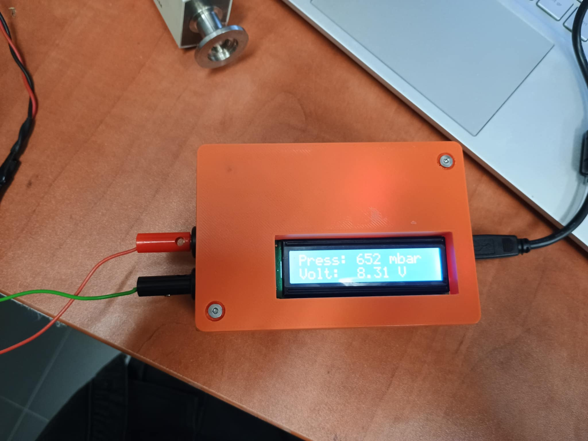
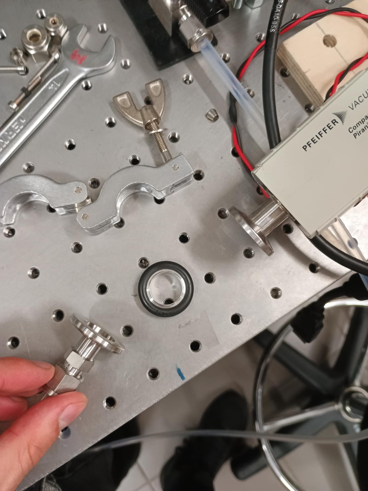

# Instrumentation for Pirani Vacuum Gauge TPR 265

  
  

## Project Overview

This project involves the design and implementation of an electronic readout system for the **TPR 265 Pirani vacuum gauge**. The analog voltage output from the sensor is processed using an Arduino Uno and displayed on a 16x2 I2C LCD. The device enables pressure monitoring in a wide range using a logarithmic transfer function.

## TPR 265 Sensor Specifications

- **Power Supply**: 15 V DC  
- **Voltage Output**: 0 – 10.3 V  
- **Operating Signal Range**: 2.2 – 8.5 V  
- **Output Behavior**: Logarithmic — voltage **decreases** as pressure **increases**  
- **Pressure Measurement Range**:  
  - 3.75×10⁻⁴ Torr < _p_ < 750 Torr  
  - 5×10⁻² Pa < _p_ < 1×10⁵ Pa  

### Reference Points

- **5×10⁻⁴ mbar** → approx. **8.5 V**  
- **1000 mbar** → approx. **2.2 V**

## Voltage Divider for Safe ADC Reading

Since the Arduino ADC operates in the 0–5V range, a voltage divider was used to scale down the sensor output.  

- **Voltage observed at atmospheric pressure**:  
  - Original: 8.36 V  
  - After divider: ~3.44 V  
- **Resistor values**:  
  - R1 = 6.82 kΩ  
  - R2 = 4.7 kΩ  
- **Divider ratio (measured)**: ≈ 2.435  
- **Formula**:  
  $$V_{in} = V_{out} \times \left(1 + \frac{R1}{R2}\right)$$

## Pressure-Voltage Relation

- Logarithmic response:  
  - **~1.0 V per decade** of pressure  
- Conversion based on formula:  
  $$p = 10^{(V_{sensor} - C)}$$
  Where `C` is a calibration constant (depends on unit and gas type).

## Arduino Implementation

The code includes:
- Support for multiple gas types with corresponding calibration factors
- Configurable pressure units (e.g., Torr, Pa, mbar, etc.)
- LCD output of pressure and sensor voltage
- Error/status detection for out-of-range voltages
- Voltage-to-pressure interpolation (optional support)

### Supported Gases and Calibration Factors

| Gas              | Calibration Factor |
|------------------|--------------------|
| Air / N₂ / O₂ / CO | 1.0 (default)     |
| CO₂              | 0.9                |
| H₂O Vapor        | 0.5                |
| H₂               | 0.5                |
| He               | 0.8                |
| Ne               | 1.4                |
| Ar               | 1.7                |
| Kr               | 2.4                |
| Xe               | 3.0                |
| Freon-12         | 0.7                |

### Supported Units and Calibration Constants

| Unit      | Calibration Constant |
|-----------|----------------------|
| mbar      | 5.5                  |
| µbar      | 2.5                  |
| Pa        | 3.5                  |
| kPa       | 6.5                  |
| Torr      | 5.625                |
| mTorr     | 2.625                |
| micron    | 2.625                |

| Component       | Connection                   |
|----------------|------------------------------|
| Sensor Output   | Analog input A0 (via divider)|
| LCD Display     | I2C (SDA → A4, SCL → A5)     |
| Power           | +5V and GND                  |
